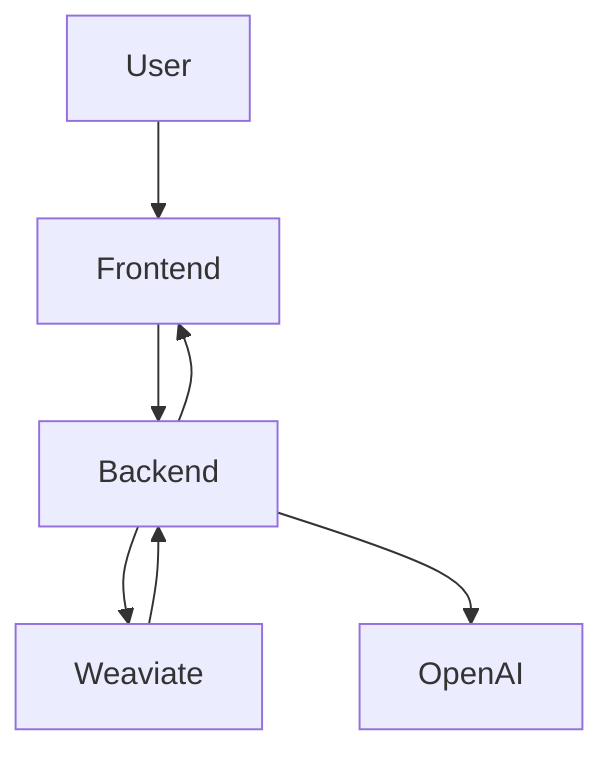

# RAG System Project -> URL -> https://rag-system1-2.onrender.com

## Step-by-Step Summary of the RAG System Project

### Overview

- **Purpose:** Enhance text generation by incorporating document context.
- **Key Components:**
  - **Backend:** Node.js/Express for file handling, text extraction, embedding generation, and query processing.
  - **Frontend:** React.js for uploading PDFs, inputting queries, and displaying results.
  - **Database & API:**
    - **Weaviate:** Stores vector embeddings for efficient semantic search.
    - **OpenAI API:** Generates high-quality text embeddings.

---

## Project Structure

```
/project-root
│── /backend
│   ├── index.js
│   ├── .env
│   ├── package.json
│   ├── /docs
│── /frontend
│   ├── /src
│   │   ├── components
│   │   │   ├── Upload.js
│   │   │   ├── QueryInput.js
│   │   │   ├── ResultDisplay.js
│   ├── package.json
│── .gitignore
│── README.md
```

- **Backend Folder:**
  - Contains server code (`index.js`), configuration files (`.env`), and documentation.
- **Frontend Folder:**
  - Contains React components:
    - `Upload.js` - Handles file selection and upload.
    - `QueryInput.js` - Collects user queries and sends them to the backend.
    - `ResultDisplay.js` - Displays query results.
  - Includes HTML, CSS, and other assets.
- **Common Files:**
  - `.gitignore` - Manages version control exclusions.

---

## System Architecture



- **Frontend (React)**
  - Allows users to upload PDF documents and input queries.
- **Backend (Node.js/Express)**
  - Processes uploaded documents by extracting text, partitioning it, and generating embeddings.
- **Weaviate Database**
  - Stores and retrieves vector embeddings.
- **OpenAI API**
  - Provides embedding generation for document content.

---

## Backend Implementation Steps

### 1. Setup:
- Install dependencies:
  ```sh
  npm install express multer dotenv weaviate-client openai
  ```
- Configure a `.env` file with necessary API keys and URLs.

### 2. File Upload & Processing:
- **Endpoint `/upload`**
  - Saves the PDF.
  - Extracts text.
  - Partitions text into manageable chunks.
  - Generates embeddings.
  - Stores embeddings in Weaviate.

### 3. Query Handling:
- **Endpoint `/qa`**
  - Accepts user queries.
  - Retrieves relevant document chunks.
  - Returns results.

---

## Frontend Implementation Steps

### Component Structure:
- **Upload Component:** Manages file selection and uploading.
- **Query Input Component:** Collects user queries and communicates with the backend.
- **Result Display Component:** Presents the query results to the user.

### User Flow:
1. User uploads a PDF.
2. The backend processes the document.
3. User submits a query to retrieve relevant excerpts from the processed document.

---

## Deployment Instructions

### Backend Deployment:
1. Clone the repository:
   ```sh
   git clone https://github.com/yourusername/rag-system.git
   cd rag-system/backend
   ```
2. Install dependencies:
   ```sh
   npm install
   ```
3. Configure the `.env` file with necessary API keys and URLs.
4. Start the server:
   ```sh
   node index.js
   ```

### Frontend Deployment:
1. Navigate to the frontend directory:
   ```sh
   cd ../frontend
   ```
2. Install dependencies:
   ```sh
   npm install
   ```
3. Launch the React development server:
   ```sh
   npm start
   ```

### Production Considerations:
- **Backend:** Deploy on platforms like Render, AWS, or Heroku.
- **Frontend:** Deploy on platforms like Vercel or Netlify.
- Secure environment variables and ensure proper logging/monitoring.

---

## Performance Optimization & Best Practices

- **Document Processing**
  - Split PDFs into manageable chunks.
  - Precompute embeddings for faster query responses.
- **Query Performance**
  - Implement caching strategies.
  - Fine-tune search parameters in Weaviate.
- **Security**
  - Use secure `.env` configurations.
  - Implement proper CORS policies.

---

## Troubleshooting

### Common Issues:
- ❌ **CORS errors**
- ❌ **File upload failures**
- ❌ **Slow query responses**

### Solutions:
- ✅ Ensure proper backend and frontend configuration.
- ✅ Verify file formats (PDF only).
- ✅ Check network stability and server logs for errors.

---

## Future Enhancements

- 🔍 Explore advanced retrieval algorithms.
- 📄 Support additional file formats (e.g., CSV, Markdown).
- 🎨 Improve UI/UX for a better user experience.
- 🚀 Enhance scalability and implement custom embedding models.

---

## Conclusion

The RAG system efficiently integrates document context into text generation workflows. By processing and indexing PDFs, it becomes easier to retrieve and utilize relevant information, significantly enhancing text generation and search capabilities.
